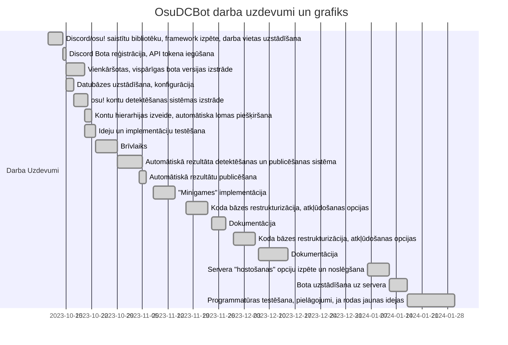

# osu! Discord bot

A discord bot that links player's osu accounts to their discord accounts using discord rich presence and automatically assigns discord roles based on osu! country rank. It also automatically posts new user top scores and high leaderboard topscores every hour. It also has extra features such as minigames to award daily play and incentivize activity both in game and in the discord server.

# Epic Value Statement

FOR Latvians
WHO play osu! and use Discord
THE osu! Discord bot
IS AN automatic statistics and community management tool
THAT allows users to view in-depth osu! statistics in various categories and assigns them roles to allow for more complex interactions
UNLIKE other osu! statistic tracking bots
OUR SOLUTION uses automatic account linking and role assignment for high level customizability and interactions

# Komanda

Dāvis Ērglis - galvenais izstrādātājs
Adriāns Piliksers - programmētājs
Aleksandrs Vjaters - programmētājs

# Izmantotās tehnoloģijas

JavaScript, NodeJS, discord.js, PostgreSQL, WebSockets

# Darba plāns

# Atjaunotais darba plānojums novembrim

